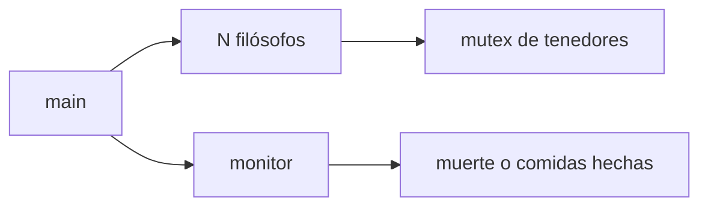

# philosophers

Cena de los filósofos en C. Un hilo por comensal, mutex en cada tenedor y un hilo monitor que corta la simulación.

Hecho en 42 Madrid.

## Qué enseña

| | |
| --- | --- |
| Hilos | Un `pthread` por filósofo y otro para el monitor |
| Memoria compartida | Tenedores, última comida y fin de simulación, siempre bajo mutex |
| Interbloqueo | Quien tiene id par y quien tiene id impar no cogen los tenedores en el mismo orden |
| Tiempo | `gettimeofday`. La espera se interrumpe si la simulación ya ha terminado |

## Arranque



Cada filósofo coge el primer tenedor, luego el segundo, come, suelta los dos y duerme. El monitor lee la hora de la última comida. Con un solo filósofo no existe el segundo tenedor: espera, y el monitor cierra por tiempo.

## Uso

```bash
make
./philosophers 5 800 200 200
./philosophers 5 800 200 200 7
```

Los tiempos van en milisegundos: filósofos, tiempo hasta morir, tiempo comiendo, tiempo durmiendo y, si se quiere, comidas máximas por persona. Por debajo de 60 ms el programa no arranca.

## Código

| Fichero | Qué hace |
| --- | --- |
| `dinner.c` | Rutina de cada hilo |
| `monitor.c` | Decide cuándo se acaba |
| `init.c` | Mesa, tenedores y orden en que se cogen |
| `handlers.c` | Crear, unir y bloquear, comprobando el error |
| `gettersAndSetters.c` | Lectura y escritura compartida |
